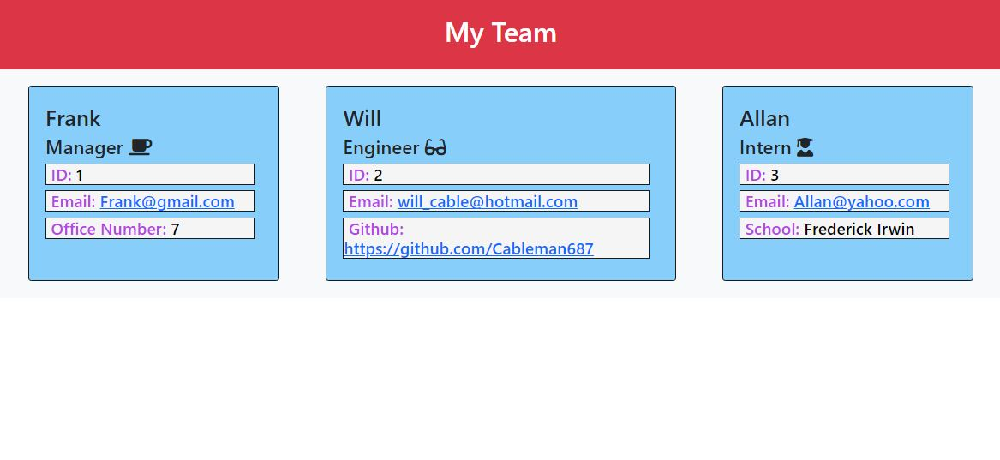

# team-profile-generator

## Description

Application Demonstration Video: https://drive.google.com/file/d/1kh1-iw9CNqLrecbA0nKH-6TwU0NPhAF9/view

- The motivation to complete this challenge was to test my own skills gained in the most recent week of the coding bootcamp, including but not limited to: Constructors, Polymorphism, Promisies & Async, Tests and Classes.
- This project was built as a testing ground for my own retention of the aforementioned skills.
- This application allows a team leader to generate a team through a series of clear, concise prompts, and view the result in a clean html output format.
- Through building this application, I learnt that there are many programming skills outside of what we learn throughout the week, and that research and collaboration is critical in order to achieve the best outcome for any given project.

## Installation

Install Node.js\
Please follow the instructions to install Node.js on your machine from the link below:\
https://coding-boot-camp.github.io/full-stack/nodejs/how-to-install-nodejs

Install Inquirer\
Please follow the instructions to install Inquirer on your machine from the link below:\
https://coding-boot-camp.github.io/full-stack/nodejs/how-to-install-nodejs

Install Jest\
Please follow the instructions to install Jest on your machine from the link below:\
https://jestjs.io/docs/getting-started 

## Usage

Using GitBash, navigate to the application directory until index.js is visible. Once inside, use command prompt 'node index.js' to begin a series of prompts requesting information from the user.

The user will be asked for details on each team member they would like into their team, including name, ID's, github usernames and others.

Once the user has added as many team members as they want, they are to select "I do not want to add any more team members", and the html will be generated. Using the VScode live server they will then be able to view their created team. Combined with github pages, an official link may be generated like the one below:\

https://cableman687.github.io/team-profile-generator/

## License

MIT

## How to Contribute

This repository is not open for public contribution.

## Tests

Once inside the App directory, from the CLI enter the command 'npm install' to initiate the testing protocols. These test are designed to test the integrity of the classes used to build each employee type, and their constructors.
